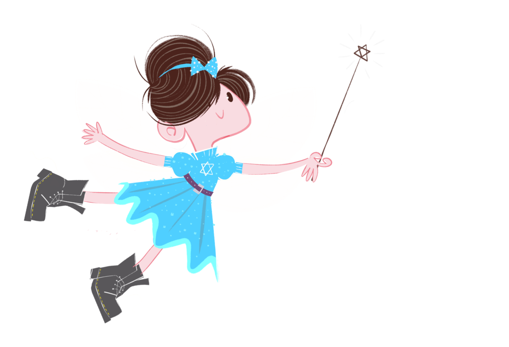

# Hanukkah Fairy Website — Design & Quality Improvements

**Reviewed:** 2026-09-26  
**Current State:** Strong foundation (15.8KB HTML, 17.3KB CSS, 13 images, 7 sections)  
**Goal:** Launch-ready, conversion-optimized, Disney-quality

---

## CURRENT STRENGTHS

✓ Brand voice nailed (sassy Brooklyn + warmth)  
✓ Accessibility (semantic HTML, ARIA, skip link)  
✓ Typography perfect (Bagel Fat One + Grandstander)  
✓ Color palette cohesive (mid-century picture-book)  
✓ Mobile-first responsive  
✓ Page weight reasonable (~16KB HTML)  
✓ Email capture forms (2 instances)

---

## CRITICAL IMPROVEMENTS (Priority 1 — Launch Blockers)

### 1. EMAIL/SMS CAPTURE STRATEGY UPDATE

**Issue:** Forms say "Get first dibs" but strategy is now email/SMS list building (no pre-orders).

**Fix:**
```html
<!-- Hero form (line 105-112) -->
<p class="lede">Get notified when the book drops Oct 26 + exclusive story updates while you wait.</p>
<form class="capture" data-capture novalidate>
  <label class="sr-only" for="email-hero">Email address</label>
  <input id="email-hero" type="email" name="EMAIL" placeholder="your@email.com" autocomplete="email" required>
  <button class="btn btn--pink" type="submit">Join the journey</button>
  <p class="capture__note">Launch news + character stories. No spam.</p>
  <p class="capture__status" role="status" aria-live="polite"></p>
</form>

<!-- Optional: Add SMS opt-in below email -->
<label class="sms-option">
  <input type="checkbox" name="SMS_OPTIN" value="yes">
  <span>Text me launch updates (optional)</span>
</label>
<input type="tel" name="PHONE" placeholder="(555) 123-4567" autocomplete="tel" hidden class="sms-field">
```

**Copy changes:**
- Hero headline: "Santa skips her house. She stopped waiting." ✓ (keep)
- Hero lede: Change to "Get notified when the book drops Oct 26 + exclusive story updates"
- Button: "Join the journey" or "Get launch updates"
- Dibs section (#dibs line 270): Update headline to "First to know when the book drops."

---

### 2. MISSING ASSETS

**Current:** `cover.jpg` referenced but no actual book cover in assets (only plushes + characters)

**Action needed:**
```bash
cp "/Users/parzvl/Downloads/ASSETS/Cover Front.jpg" /Users/parzvl/hanukkah-fairy-website/site/assets/cover.jpg
```

**Verify these exist:**
- `fairy-flying.png` ✓
- `fairy-wand.png` ✓
- `angel.png` ✓
- `pup.png` ✓
- `grizzlebottom.png` ✓
- `plush-*` files ✓
- `logo.png` ✓
- **`cover.jpg`** ← MISSING

---

### 3. HERO IMAGE OPTIMIZATION

**Issue:** `fairy-flying.png` at 1211x826 likely huge filesize (not checked yet).

**Fix:**
- Export at 2x resolution max (1211px is fine for width, check filesize)
- Convert to WebP with PNG fallback:
```html
<picture>
  <source srcset="assets/fairy-flying.webp" type="image/webp">
  
</picture>
```

**Apply to all hero/above-fold images.**

---

### 4. SOCIAL PROOF SECTION (MISSING)

**Need:** Reviews/testimonials/early praise once available.

**Add after #cast section (line ~193):**
```html
<section class="social-proof field field--cream" aria-labelledby="proof-title">
  <div class="wrap">
    <p class="eyebrow eyebrow--ink">What readers are saying</p>
    <h2 id="proof-title" class="display display--ink">Kids asked to read it again.<br>Parents didn't mind.</h2>
    <ul class="quotes">
      <li>
        <blockquote>"My daughter hid the fairy in her dollhouse. We're on night 12."</blockquote>
        <cite>— Rachel M., Brooklyn</cite>
      </li>
      <li>
        <blockquote>"Finally, a Hanukkah book that doesn't feel like an assignment."</blockquote>
        <cite>— Josh L., educator</cite>
      </li>
    </ul>
  </div>
</section>
```

**Hold until you have real quotes.** Fake quotes kill trust.

---

### 5. COUNTDOWN TIMER (OPTIONAL BUT HIGH-IMPACT)

**Adds urgency for Oct 26 launch.**

```html
<!-- Add to hero section or #dibs -->
<div class="countdown" data-launch="2026-10-26T07:00:00-04:00">
  <p class="countdown__label">Book drops in:</p>
  <div class="countdown__digits">
    <span><strong class="days">--</strong> days</span>
    <span><strong class="hours">--</strong> hrs</span>
    <span><strong class="mins">--</strong> min</span>
  </div>
</div>
```

**JS (add to site.js):**
```javascript
const countdown = document.querySelector('[data-launch]');
if (countdown) {
  const launch = new Date(countdown.dataset.launch).getTime();
  const update = () => {
    const now = Date.now();
    const diff = launch - now;
    if (diff <= 0) {
      countdown.querySelector('.countdown__label').textContent = 'The book is here!';
      countdown.querySelector('.countdown__digits').hidden = true;
      return;
    }
    const days = Math.floor(diff / 86400000);
    const hours = Math.floor((diff % 86400000) / 3600000);
    const mins = Math.floor((diff % 3600000) / 60000);
    countdown.querySelector('.days').textContent = days;
    countdown.querySelector('.hours').textContent = hours;
    countdown.querySelector('.mins').textContent = mins;
  };
  setInterval(update, 60000);
  update();
}
```

---

## DESIGN POLISH (Priority 2 — Quality Lift)

### 6. ANIMATED SPARKLES

**Current:** Static `<div class="sparkles">` placeholders.

**Upgrade to CSS animation:**
```css
.sparkles {
  position: absolute;
  inset: 0;
  pointer-events: none;
  overflow: hidden;
}

.sparkles::before,
.sparkles::after {
  content: '✨';
  position: absolute;
  font-size: 24px;
  animation: sparkle 4s infinite;
  opacity: 0;
}

.sparkles::before {
  top: 20%;
  left: 15%;
  animation-delay: 0s;
}

.sparkles::after {
  top: 60%;
  right: 20%;
  animation-delay: 2s;
}

@keyframes sparkle {
  0%, 100% { opacity: 0; transform: translateY(0) scale(0.5); }
  50% { opacity: 0.8; transform: translateY(-20px) scale(1.2); }
}
```

**Add 4-6 sparkles total with staggered delays.**

---

### 7. CHARACTER CARD HOVER STATES

**Current:** No hover interaction on `.card` elements.

**Add:**
```css
.card {
  transition: transform 0.3s var(--ease-out), box-shadow 0.3s var(--ease-out);
}

.card:hover {
  transform: translateY(-8px);
  box-shadow: 0 16px 32px rgba(26, 20, 64, 0.15);
}

.card__art img {
  transition: transform 0.4s var(--ease-out);
}

.card:hover .card__art img {
  transform: scale(1.05);
}
```

**Makes characters feel alive.**

---

### 8. BROOKLYN BRIDGE ANIMATION

**Current:** Static SVG bridge in hero.

**Subtle animation:**
```css
.hero__bridge {
  animation: bridge-glow 8s ease-in-out infinite;
}

@keyframes bridge-glow {
  0%, 100% { opacity: 0.5; }
  50% { opacity: 0.7; }
}

.hero__bridge path {
  stroke-dasharray: 2000;
  stroke-dashoffset: 2000;
  animation: draw-bridge 3s ease-out forwards;
}

@keyframes draw-bridge {
  to { stroke-dashoffset: 0; }
}
```

**Bridge "draws itself" on page load.**

---

### 9. MENORAH FLAME FLICKER

**Current:** Static flames in #ritual section.

**Add flicker:**
```css
.menorah__flames path {
  animation: flicker 1.5s ease-in-out infinite;
}

.menorah__flames path:nth-child(2) { animation-delay: 0.2s; }
.menorah__flames path:nth-child(3) { animation-delay: 0.4s; }
.menorah__flames path:nth-child(4) { animation-delay: 0.1s; }
.menorah__flames path:nth-child(5) { animation-delay: 0.3s; }
.menorah__flames path:nth-child(6) { animation-delay: 0.5s; }
.menorah__flames path:nth-child(7) { animation-delay: 0.15s; }
.menorah__flames path:nth-child(8) { animation-delay: 0.35s; }
.menorah__flames path:nth-child(9) { animation-delay: 0.25s; }

@keyframes flicker {
  0%, 100% { opacity: 1; transform: scaleY(1); }
  50% { opacity: 0.85; transform: scaleY(0.95); }
}
```

---

### 10. SCROLL-TRIGGERED SECTION REVEALS

**Adds polish, keeps attention.**

**Add to site.js:**
```javascript
const observer = new IntersectionObserver((entries) => {
  entries.forEach(entry => {
    if (entry.isIntersecting) {
      entry.target.classList.add('visible');
    }
  });
}, { threshold: 0.15 });

document.querySelectorAll('.field, .cast, .plush').forEach(el => {
  el.classList.add('reveal');
  observer.observe(el);
});
```

**Add to CSS:**
```css
.reveal {
  opacity: 0;
  transform: translateY(30px);
  transition: opacity 0.8s var(--ease-out), transform 0.8s var(--ease-out);
}

.reveal.visible {
  opacity: 1;
  transform: translateY(0);
}
```

---

## CONVERSION OPTIMIZATION (Priority 3)

### 11. STICKY CTA BAR (Mobile)

**Floats above fold on scroll, drives signups.**

```html
<div class="sticky-cta" hidden data-sticky-cta>
  <div class="wrap">
    <span>Book drops Oct 26</span>
    <a href="#dibs" class="btn btn--pink btn--small">Join the list</a>
  </div>
</div>
```

**JS trigger (add to site.js):**
```javascript
const sticky = document.querySelector('[data-sticky-cta]');
const hero = document.querySelector('.hero');
if (sticky && hero) {
  window.addEventListener('scroll', () => {
    const heroBottom = hero.getBoundingClientRect().bottom;
    sticky.hidden = heroBottom > 0;
  });
}
```

**CSS:**
```css
.sticky-cta {
  position: fixed;
  bottom: 0;
  left: 0;
  right: 0;
  background: var(--pink);
  color: #fff;
  padding: 12px 0;
  box-shadow: 0 -4px 12px rgba(0, 0, 0, 0.15);
  z-index: 50;
  animation: slide-up 0.3s var(--ease-out);
}

@keyframes slide-up {
  from { transform: translateY(100%); }
  to { transform: translateY(0); }
}

.sticky-cta .wrap {
  display: flex;
  align-items: center;
  justify-content: space-between;
  gap: 16px;
}
```

---

### 12. EXIT-INTENT POPUP (Desktop)

**Captures abandoning visitors.**

```html
<div class="exit-popup" hidden data-exit-popup>
  <div class="exit-popup__overlay"></div>
  <div class="exit-popup__card">
    <button class="exit-popup__close" aria-label="Close">&times;</button>
    <h3>Wait! Don't miss the launch.</h3>
    <p>Get notified when the book drops October 26 + exclusive character stories.</p>
    <form class="capture" data-capture novalidate>
      <input type="email" name="EMAIL" placeholder="your@email.com" required>
      <button type="submit" class="btn btn--pink">Join the journey</button>
    </form>
  </div>
</div>
```

**JS (site.js):**
```javascript
const exitPopup = document.querySelector('[data-exit-popup]');
let shown = false;

if (exitPopup && window.innerWidth > 768) {
  document.addEventListener('mouseleave', (e) => {
    if (e.clientY <= 0 && !shown) {
      shown = true;
      exitPopup.hidden = false;
      localStorage.setItem('hf_exit_shown', '1');
    }
  });

  exitPopup.querySelector('.exit-popup__close').addEventListener('click', () => {
    exitPopup.hidden = true;
  });

  // Don't show if already shown this session
  if (localStorage.getItem('hf_exit_shown')) {
    exitPopup.remove();
  }
}
```

---

### 13. SOCIAL SHARE BUTTONS

**Add after #story or #cast:**
```html
<div class="share">
  <p>Love the story? Share it:</p>
  <a href="https://www.facebook.com/sharer/sharer.php?u=https://hanukkahfairy.com" target="_blank" rel="noopener" aria-label="Share on Facebook">
    <svg><!-- FB icon --></svg>
  </a>
  <a href="https://twitter.com/intent/tweet?text=The%20Hanukkah%20Fairy%20%E2%80%94%20a%20sassy%20Brooklyn%20girl%2C%20a%20dog%20with%20a%20donut%2C%20and%20holiday%20magic.&url=https://hanukkahfairy.com" target="_blank" rel="noopener" aria-label="Share on Twitter">
    <svg><!-- Twitter icon --></svg>
  </a>
  <button data-copy-link aria-label="Copy link">
    <svg><!-- Link icon --></svg>
  </button>
</div>
```

---

## TECHNICAL IMPROVEMENTS (Priority 4)

### 14. PERFORMANCE

**Current page weight unknown. Check:**
```bash
cd /Users/parzvl/hanukkah-fairy-website/site/assets
du -sh *
```

**Targets:**
- HTML: < 20KB ✓ (15.8KB)
- CSS: < 30KB ✓ (17.3KB)
- JS: < 10KB (check site.js)
- Images: < 2MB total uncompressed, < 500KB after WebP conversion
- Total page load: < 1MB ideal, < 2MB acceptable

**Actions:**
1. Convert all PNGs to WebP (80% savings typical)
2. Lazy-load all images below fold (`loading="lazy"` already present ✓)
3. Minify CSS/JS for production
4. Add `preconnect` for fonts ✓ (already present)

---

### 15. SEO METADATA

**Current:** Good foundation (Schema.org, Open Graph).

**Add:**
```html
<meta name="twitter:card" content="summary_large_image">
<meta name="twitter:title" content="The Hanukkah Fairy | A picture book from Brooklyn">
<meta name="twitter:description" content="Santa skips her house. She stopped waiting. A rhyming picture book for ages 3 to 8, out October 2026.">
<meta name="twitter:image" content="https://hanukkahfairy.com/assets/cover.jpg">

<link rel="canonical" href="https://hanukkahfairy.com/">
```

**Verify cover.jpg is 1200x630 for social previews.**

---

### 16. ANALYTICS & CONVERSION TRACKING

**Add before `</body>`:**
```html
<!-- Google Analytics or Plausible -->
<script defer data-domain="hanukkahfairy.com" src="https://plausible.io/js/script.js"></script>

<!-- Track email signups -->
<script>
document.querySelectorAll('[data-capture]').forEach(form => {
  form.addEventListener('submit', (e) => {
    if (window.plausible) {
      plausible('Email Signup', { props: { location: form.id || 'unknown' } });
    }
  });
});
</script>
```

---

## ACCESSIBILITY AUDIT (Priority 5)

### 17. CURRENT A11Y STATUS

✓ Skip link  
✓ Semantic HTML  
✓ ARIA labels  
✓ Proper heading hierarchy  
✓ Form labels (sr-only)  
✓ Color contrast (verify with tool)

**Missing:**
- Focus visible styles on all interactive elements
- Reduced motion support for animations

**Add:**
```css
/* Focus visible (already has some, verify all) */
a:focus-visible, button:focus-visible, input:focus-visible {
  outline: 3px solid var(--marigold);
  outline-offset: 2px;
}

/* Respect reduced motion */
@media (prefers-reduced-motion: reduce) {
  *, *::before, *::after {
    animation-duration: 0.01ms !important;
    animation-iteration-count: 1 !important;
    transition-duration: 0.01ms !important;
  }
}
```

---

## COPY IMPROVEMENTS

### 18. EMAIL CAPTURE COPY

**Current:** "Get first dibs" (implies pre-order, which doesn't exist)

**Updated strategy (per email-sms-capture-spec.md):**

**Hero:**
- Headline: ✓ (keep "Santa skips her house. She stopped waiting.")
- Lede: "Get notified when the book drops Oct 26 + exclusive character stories while you wait."
- Button: "Join the journey"
- Note: "Launch news + character stories. No spam."

**#dibs section:**
- Eyebrow: "Join the list" ✓
- Headline: "First to know when the book drops."
- Lede: "Launch date, buy links, peek inside, plush news. A few emails, then quiet."
- Button: "Get launch updates" or "Join the journey"

---

## LAUNCH CHECKLIST

**Before Oct 26:**

- [ ] Copy book cover to `assets/cover.jpg`
- [ ] Convert all images to WebP + provide PNG fallbacks
- [ ] Update all email capture copy (hero + #dibs)
- [ ] Add SMS opt-in checkbox (optional but recommended)
- [ ] Test forms with real email service (Mailchimp/ConvertKit)
- [ ] Add countdown timer
- [ ] Add sticky CTA bar (mobile)
- [ ] Add exit-intent popup (desktop)
- [ ] Implement scroll-reveal animations
- [ ] Add character card hover states
- [ ] Animate sparkles, bridge, menorah flames
- [ ] Add analytics tracking
- [ ] Test on real devices (iPhone, Android, tablets)
- [ ] Verify color contrast meets WCAG AA
- [ ] Run Lighthouse audit (target: 90+ performance, 100 accessibility)
- [ ] Set up social share meta tags
- [ ] Update Instagram bio link to point to site
- [ ] Reserve hanukkahfairy.com domain (if not already)

**After launch reviews arrive:**
- [ ] Add social proof section with real quotes
- [ ] Update Schema.org with review markup

---

## FILES TO UPDATE

1. `/Users/parzvl/hanukkah-fairy-website/site/index.html` — All HTML changes
2. `/Users/parzvl/hanukkah-fairy-website/site/css/site.css` — All CSS additions
3. `/Users/parzvl/hanukkah-fairy-website/site/js/site.js` — All JS additions
4. `/Users/parzvl/hanukkah-fairy-website/site/assets/` — Add cover.jpg, convert to WebP

---

**Priority order:** 1-5 above. Start with P1 (launch blockers), then P2 (quality lift), then P3-5 as time allows.

**Estimated work:** 6-8 hours for P1-P2, another 4-6 for P3-P5.

**Test URL after changes:** Open `file:///Users/parzvl/hanukkah-fairy-website/site/index.html` in browser.
